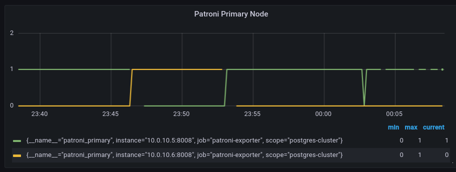
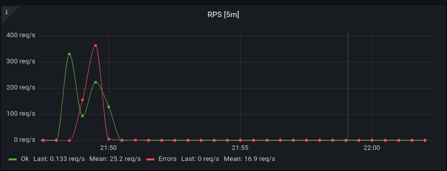
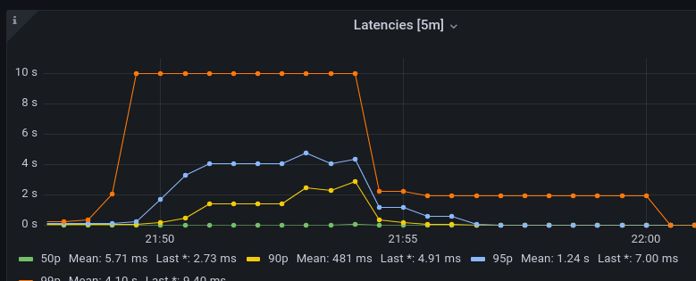
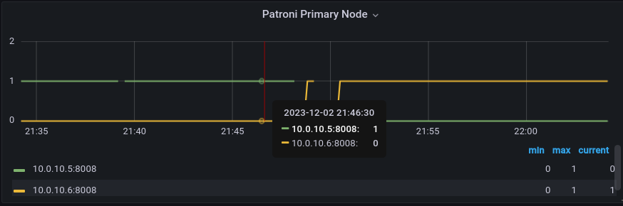
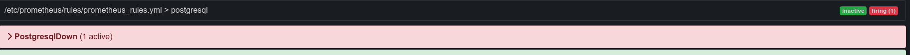
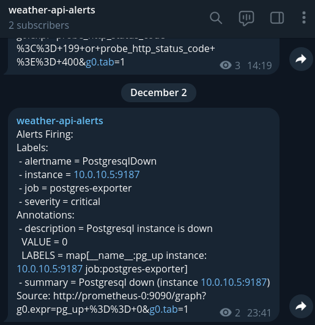
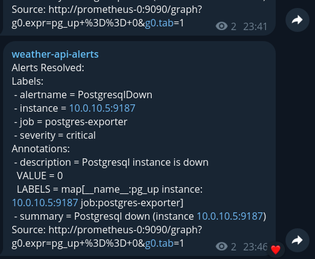

# Weather API chaos test

    0. Исходные данные
    
    Настроенный и штатно функционирующий кластер postgres на базе patroni.

    Конфигурация:    
        - Master-нода: 10.0.10.5  
        - Slave-нода:  10.0.10.6
    
        <pic>

## Отключение узла базы данных.

    1. Описание эксперимента

        Попробуем остановить сервис patroni на master-ноде, сымитировав таким образов выход master-узла из строя.
        Это должно вызвать запуск процесса перевыбора master'а в кластере.
        Убедимся, что master изменился.
        Запустим сервис patroni, убедимся, что в кластере снова две ноды и Master не вернулся к первой ноде.

    2. Ожидаемые результаты  

        После выключения сервиса patroni на master-ноде происходит кратковременная недоступность кластера, т.к. запускается процесс выбора нового master. Через некоторое время (1-5сек) должен определиться новый master (ранее наш slave).
        После включения сервиса patroni на ноде старого master (который сейчас slave), ничего не  должно произойти.

    3. Реальные результаты

        После выключения сервиса patroni на master-ноде начинается процедура выбора нового мастера и кластер переходит снова в рабочее состояние. Процедура занимает около 2x секунд.

        logЛог master-ноды: 
        ```shell
        > less /var/log/postgresql/postgresql-Tue.log
        ...
        2023-11-28 00:07:26 MSK [1259-12]  LOG:  database system is shut down

        > less 
        Nov 28 00:07:25 pg-0 postgres_exporter[722]: ts=2023-11-27T21:07:25.971Z caller=collector.go:173 level=error msg="Error opening connection to database" err="error querying postgresql version: read tcp 127.0.0.1:43510->127.0.0.1:5432: read: connection reset by peer"
        ...
        ```

        Лог slave-ноды:
        ```shell
        > less /var/log/postgresql/postgresql-Tue.log
        ...
        Nov 28 00:07:27 pg-1 patroni[9094]: 2023-11-28 00:07:27,242 INFO: promoted self to leader by acquiring session lock
        Nov 28 00:07:27 pg-1 patroni[9094]: INFO:patroni.ha:Lock owner: pg-1; I am pg-1
        ...
        ```

        Обнаружил интересный эффект: если вырубить master и slave базы и дать нагрузку 100рпс - приложение падает в кубере. 

        ```shell
        > kubectl get pods
        
        NAME                          READY   STATUS    RESTARTS          AGE
        weather-api-fbf499ff5-5pd4r   1/1     Running   133 (105s ago)    36d
        weather-api-fbf499ff5-b9csn   1/1     Running   140 (111s ago)    36d
        weather-api-fbf499ff5-fmt2m   1/1     Running   135 (2m11s ago)   36d
        ```

        <screenshot с потреблением ресурсов>

    4. Анализ результатов

        Единственное отклонение - поведение weather-api приложение при недоступности базы. Очень странно, что под нагрузкой в 100рпс и без подключения к базе оно валиться.
        Как предложение: стоит вынести логи patroni в отдельный лог-файл и попробовать добавить в лог миллисекунды.

## Имитация частичной потери сети

    1. Описание эксперимента
        
        Используем утилиту `tc` и произведем 3 эксперимента:
            - добавим потерю 25% пакетов в сети
            - добавим потерю 50% пакетов в сети
            - добавим разрывы TCP
        Посмотрим как вырастет время выбора и переключения на нового master'а при отказе текущей master-ноды.
    
    2. Ожидаемые результаты
        
        Ожидаем, что в обоих экспериментах должно увеличится время выбора и количество переключений на новую master-ноду.
    
    3. Реальные результаты
    
        В первом эксперименте потеря пакетов не привела к увеличению времени выбора и увеличению перевыборов.
        В втором эксперименте потеря пакетов привела к морганию лидера: он выпадал, но успевал обновить свой лок. Появились пробелы в выгрузке метрик.
        
        лог мастера:
        ```
        Nov 29 00:10:21 pg-0 patroni[718]: INFO:patroni.ha:Lock owner: pg-0; I am pg-0
        Nov 29 00:10:21 pg-0 patroni[718]: INFO:patroni.__main__:updated leader lock during demoting self because DCS is not accessible and I was a leader
        Nov 29 00:10:21 pg-0 patroni[718]: 2023-11-29 00:10:21,420 INFO: Lock owner: pg-0; I am pg-0
        Nov 29 00:10:21 pg-0 patroni[718]: 2023-11-29 00:10:21,850 INFO: updated leader lock during demoting self because DCS is not accessible and I was a leader
        ```

        

        В третьем эксперименте 

    4. Анализ результатов

## Высокая нагрузка на CPU или I/O

    1. Описание эксперимента

        Нагрузку будем делать с помощью `stress` и `cpulimit`. Для начала попробуем сделать загрузку 90% и 1 воркер на io:
        ```shell
        > stress --cpu 1 --io 1
        ```

        Ограничим запущенные инстансы по cpu: 
        ```shell
        > cpulimit -p <stress PID cpu> -l 45
        > cpulimit -p <stress PID io> -l 45
        ```

        Затем попробуем существенно перегрузить систему.
        ```shell
        > stress --cpu 5 --io 5
        ```
        Ограничивать загрузку не будем.
        Запускаем штатную нагрузку в 800 PRS на 2 мин.

    2. Ожидаемые результаты

        В первом эксперименте загрузка cpu предположительно не скажется на скорости выполнения запросов.
        Во втором эксперименте должны вырасти задержки выполнения запросов.
        
    3. Реальные результаты

        В первом случае ожидание совпало с реальными результатами: система корректно отработала заданную нагрузку в 800 RPS на 2 минуты.
        Во втором случае система после запуска нагрузки стала сыпать ошибками и сильно скакнули задержки.
        

        

        Помимо этого от перегруза упала сама виртуалка, что привело к перевыборам мастера. Мастер перешел на слейва. После переключения запросы снова стали обрабатываться.

        Лог с pg-0:
        ```
        Dec  2 21:47:58 pg-0 patroni[690]: INFO:patroni.__main__:no action. I am (pg-0), the leader with the lock
        Dec  2 21:47:58 pg-0 patroni[690]: 2023-12-02 21:47:58,502 INFO: no action. I am (pg-0), the leader with the lock
        Dec  2 21:48:08 pg-0 patroni[690]: INFO:patroni.ha:Lock owner: pg-0; I am pg-0
        Dec  2 21:48:08 pg-0 patroni[690]: INFO:patroni.__main__:no action. I am (pg-0), the leader with the lock
        Dec  2 21:48:08 pg-0 patroni[690]: 2023-12-02 21:48:08,498 INFO: no action. I am (pg-0), the leader with the lock
        Dec  2 21:48:51 pg-0 kernel: The list of certified hardware and cloud instances for Red Hat Enterprise Linux 9 can be viewed at the Red Hat Ecosystem Catalog, https://catalog.redhat.com
        .
        Dec  2 21:48:51 pg-0 kernel: Command line: BOOT_IMAGE=(hd0,gpt3)/boot/vmlinuz-5.14.0-386.el9.x86_64 root=UUID=20730677-7fa9-4b31-befb-d982e14a38af ro crashkernel=1G-4G:192M,4G-64G:256M,
        64G-:512M selinux=0 console=ttyS0 console=tty0
        Dec  2 21:48:51 pg-0 kernel: Disabled fast string operations
        Dec  2 21:48:51 pg-0 kernel: x86/fpu: Supporting XSAVE feature 0x001: 'x87 floating point registers'
        Dec  2 21:48:51 pg-0 kernel: x86/fpu: Supporting XSAVE feature 0x002: 'SSE registers'
        Dec  2 21:48:51 pg-0 kernel: x86/fpu: Supporting XSAVE feature 0x004: 'AVX registers'
        Dec  2 21:48:51 pg-0 kernel: x86/fpu: Supporting XSAVE feature 0x020: 'AVX-512 opmask'
        Dec  2 21:48:51 pg-0 kernel: x86/fpu: Supporting XSAVE feature 0x040: 'AVX-512 Hi256'
        Dec  2 21:48:51 pg-0 kernel: x86/fpu: Supporting XSAVE feature 0x080: 'AVX-512 ZMM_Hi256'
        Dec  2 21:48:51 pg-0 kernel: x86/fpu: Supporting XSAVE feature 0x200: 'Protection Keys User registers'
        Dec  2 21:48:51 pg-0 kernel: x86/fpu: xstate_offset[2]:  576, xstate_sizes[2]:  256
        Dec  2 21:48:51 pg-0 kernel: x86/fpu: xstate_offset[5]:  832, xstate_sizes[5]:   64
        Dec  2 21:48:51 pg-0 kernel: x86/fpu: xstate_offset[6]:  896, xstate_sizes[6]:  512
        Dec  2 21:48:51 pg-0 kernel: x86/fpu: xstate_offset[7]: 1408, xstate_sizes[7]: 1024
        Dec  2 21:48:51 pg-0 kernel: x86/fpu: xstate_offset[9]: 2432, xstate_sizes[9]:    8
        Dec  2 21:48:51 pg-0 kernel: x86/fpu: Enabled xstate features 0x2e7, context size is 2440 bytes, using 'compacted' format.
        Dec  2 21:48:51 pg-0 kernel: signal: max sigframe size: 3632
        Dec  2 21:48:51 pg-0 kernel: BIOS-provided physical RAM map:
        ```

        

        Пришлось восстанавливать partoni, потому что он отказался запускаться на на pg-0.
        ```
        ...
        Dec  2 22:26:21 pg-0 patroni[691]: INFO:patroni.__main__:running pg_rewind from pg-1 in progress
        ...
        Dec  2 22:26:25 pg-0 patroni[691]: INFO:patroni.postgresql.rewind:pg_rewind exit code=-15
        Dec  2 22:26:25 pg-0 patroni[691]: INFO:patroni.postgresql.rewind: stdout=
        Dec  2 22:26:25 pg-0 patroni[691]: INFO:patroni.postgresql.rewind: stderr=pg_rewind: servers diverged at WAL location 0/6B000000 on timeline 81
        Dec  2 22:26:25 pg-0 patroni[691]: pg_rewind: rewinding from last common checkpoint at 0/6A000090 on timeline 81
        Dec  2 22:26:25 pg-0 patroni[691]: 2023-12-02 22:26:25,416 INFO: pg_rewind exit code=-15
        Dec  2 22:26:25 pg-0 patroni[691]: 2023-12-02 22:26:25,416 INFO:  stdout=
        Dec  2 22:26:25 pg-0 patroni[691]: 2023-12-02 22:26:25,416 INFO:  stderr=pg_rewind: servers diverged at WAL location 0/6B000000 on timeline 81
        Dec  2 22:26:25 pg-0 patroni[691]: pg_rewind: rewinding from last common checkpoint at 0/6A000090 on timeline 81
        Dec  2 22:26:25 pg-0 patroni[691]: ERROR:patroni.postgresql.rewind:Failed to rewind from healty primary: pg-1
        ```
        
        Реинит:
        ```
        /usr/local/bin/patronictl -c /etc/patroni/patroni.yml reinit postgres-cluster pg-0
        ```

    4. Анализ результатов

        Вероятно, сильная загрузка процессора способствует не только задержкам в запросе, но и выходу системы из строя.
        Возможно, стоит доработать логику в приложении, а именно при большом количестве запросов и недоступности сокращать количество запросов в базу до того момента пока она снова станет доступной. Пока она недоступна отдавать 503 - сервис недоступен, либо завести кеш и выдавать данные оттуда.

## Тестирование систем мониторинга и оповещения

    1. Описание эксперимента

        Останавливаю сервис patroni на pg-0. 
        Проверяю, что сработает алерт в телеграм: `pg_down`` на pg-0.
        Запускаю сервис patroni на pg-0.
        Проверяю, что алерт пропадает в prometheus и получаю уведомление о прекращении алерта pg_down. 

    2. Ожидаемые результаты

        получил арерт о событии pg_down, получил уведомление о прекращении pg_down.

    3. Реальные результаты

    Остановил сервис патрони на pg-0

    Получил алерт:
    

    Получил алерт в телеграмм:
    

    Восстановил работу сервиса patroni на pg-0.
    

    Получил уведомление, что алерт закончился:
    

    4. Анализ результатов

        Все прошло как и ожидалось, нештатного поведения не выявлено.